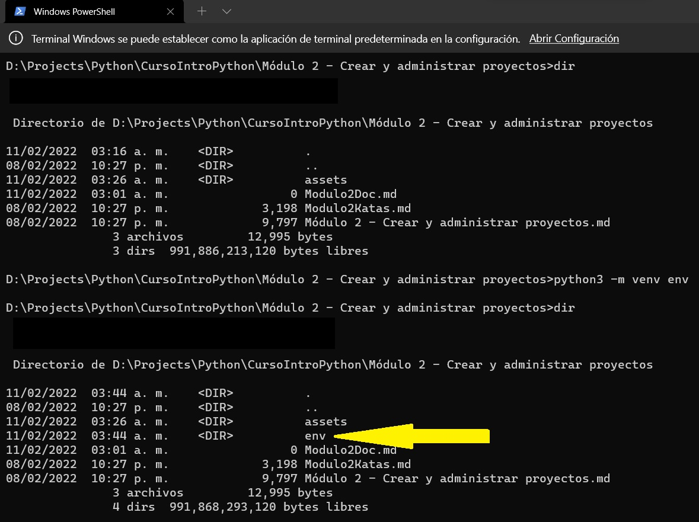
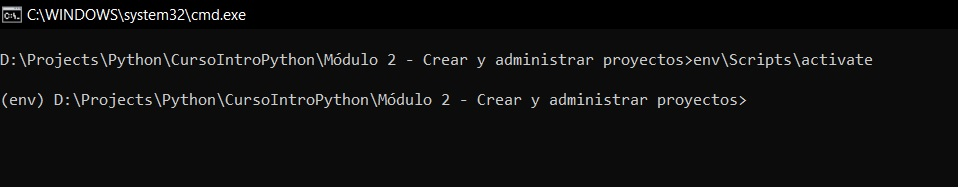
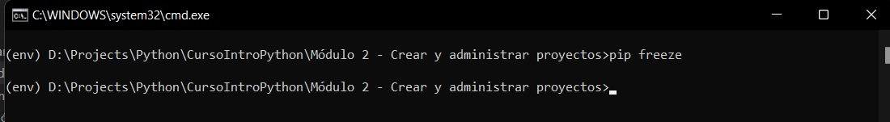
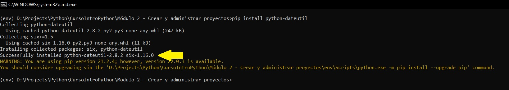
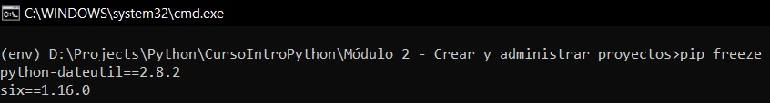

# Resolucion de kata del Módulo 2

En esta práctica se explica como generar un entorno virtual para poder trabajar de manera Aislada, esto con la finalidad de no afecta a los paquetes globales que se tengan instalados en el equipo.

## Crear un entorno virtual
Generaremos el entorno virtual mediante ``venv``, a continuación se detallan los pasos para dicho procedimiento.

Cabe mencionar que los pasos que aquí se describen fueron realizados en una computadora con sistema operativo Windows.

* Abrimos una consola 
* Ejecutar en la consola el siguiente comando: ``python3 -m venv env``

    ```
       python3 -m venv env 
    ```
* una vez ejecutado el comando nos crea una carpeta con nombre env tal como se muestra en la imagen.



* una vez generada procedemos a la activación del entorno, para ello ejecutamos el comando ``env\bin\activate``

```
env\Scripts\activate
```


## Instalar una libreria
Ahora continuaremos con la instalación de un paquete, dicho paquete solo se encontrará disponible en el entorno virtual al que estamos ingresando, pero primero verificamos que no contamos con alguna librería instalada dentro del entorno virtual, para ello ejecutamos el siguiente comando.

```
pip freeze
```


Como podemos observar, dicho comando no muestra alguna salida en la consola.

Ahora instalaremos un paquete y procederemos a ejecutar nuevamente el comando anterior para notar la diferencia en la salida de la consola. 

Para dicho ejercicio instalaremos el paquete ``python-dateutil``. Para la instalacion solo tenemos que colocar el comando
```
pip install python-dateutil
```
una vez ejecutado el comando esperamos hasta que en la consola nos muestre el mensaje ``Successfully installed`` tal como se muestra en la imagen



procedemos a ejecutar el comando ``pip freeze`` para notar la diferencia.



y cómo podemos notar, la salida en consola nos muestra los paquetes que se instalaron en el entorno activo con el comando ejecutado.

Para finalizar la practica aprenderemos a desactivar el entorno virtual.

## Desactivar Entorno Virtual

Para desactivar el entorno actual solo tenemos que colocar el comando 
```
deactivate
```
y con dicho comando salimos del entorno virtual.


Con esto Terminamos la practica.
